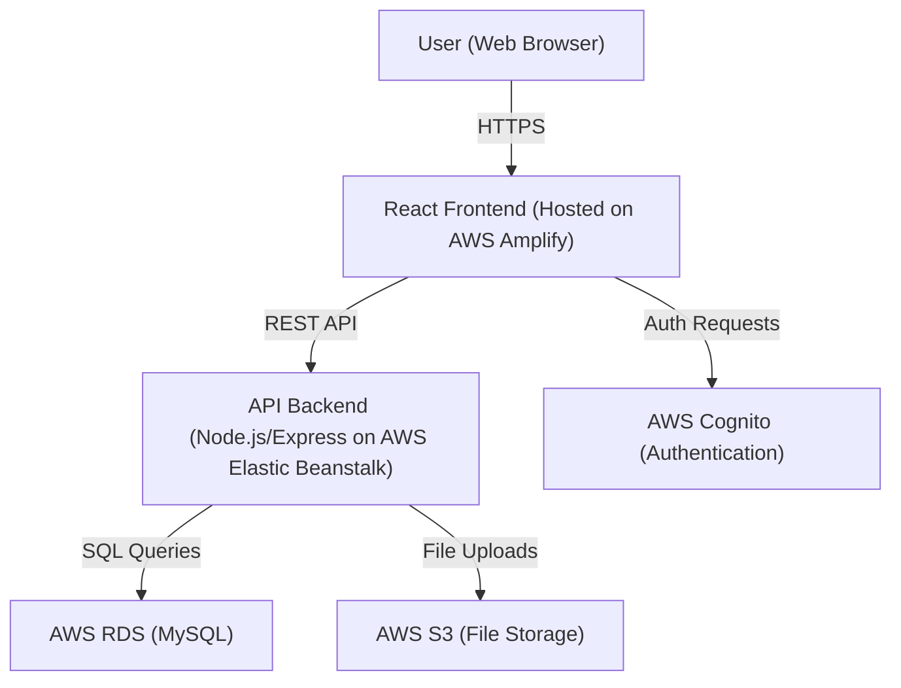

# Cloud IT Support Ticket System

A modern, cloud-ready web application for managing IT support tickets, designed for learning and showcasing cloud engineering skills.

---

## Features
- User authentication (JWT locally, AWS Cognito in cloud)
- Submit, view, and manage support tickets
- Attach files/screenshots to tickets
- Admin dashboard for ticket assignment and status updates
- SQL database (MySQL)
- Cloud storage for attachments (AWS S3)
- Responsive, modern UI (React + Material-UI)

---

## Architecture Diagram

---

## Tech Stack
- **Frontend:** React, Material-UI
- **Backend:** Node.js, Express
- **Database:** MySQL (local & AWS RDS)
- **File Storage:** Local (dev), AWS S3 (cloud)
- **Authentication:** JWT (dev), AWS Cognito (cloud)
- **Cloud Hosting:** AWS Amplify, Elastic Beanstalk

---

## Local Setup

### Prerequisites
- Node.js & npm
- MySQL
- AWS CLI (for cloud deployment)

### Steps
1. Clone the repo
2. Set up MySQL database (see backend/README.md)
3. Start backend: `cd backend && npm install && npm run dev`
4. Start frontend: `cd frontend && npm install && npm start`

---

## AWS Deployment (Overview)
- Frontend: Deploy to AWS Amplify
- Backend: Deploy to AWS Elastic Beanstalk
- Database: Provision AWS RDS (MySQL)
- File Storage: Use AWS S3
- Authentication: Set up AWS Cognito
- 
---

## Future Improvements
- Email notifications
- Ticket analytics dashboard
- Role-based access control
- Integration with Slack/MS Teams 
